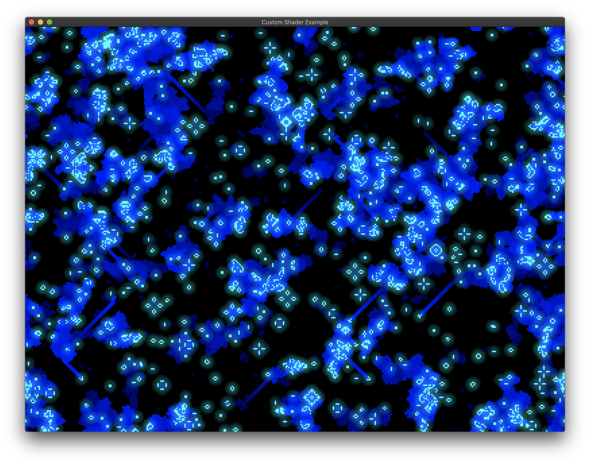

# Custom Shader Example

Based on Conway's Game of Life



## Running

```bash
cargo run --release --package custom-shader
```

## Controls

- Mouse: Left click toggles cells, dragging draws lines.
- <kbd>P</kbd>: Toggle pause.
- <kbd>space</kbd>: Frame step (enables pause if not already paused)
- <kbd>R</kbd>: Randomize
- <kbd>escape</kbd>: Quit
